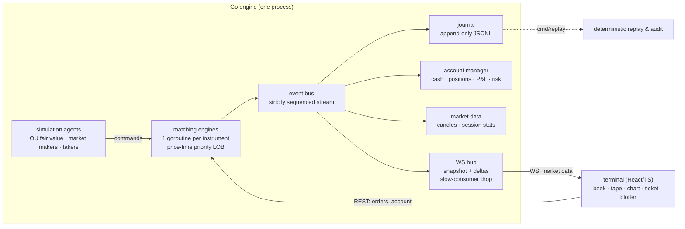

# MERIDIAN

**A real-time exchange, end to end: matching engine, simulated market, event-sourced journal, and a live trading terminal.**

Meridian is a self-contained financial exchange. A Go matching engine runs price-time
priority limit order books for five fictional instruments; an agent-based simulation
(market makers, momentum traders, noise flow) keeps the markets alive around the clock;
and a Bloomberg-style terminal built in React streams the books, tape, and candles over
WebSocket while you trade against the simulated flow with a real cash account, positions,
and mark-to-market P&L.

And the market has a plot. A **news engine** composes fictional wire headlines —
earnings beats, short reports, regulator probes, macro shocks — and injects the matching
jump and volatility regime into the affected instrument, live. Gap hard enough and the
**volatility circuit breaker** halts the stock with a countdown, exactly like a real
venue. Think you can do better than clicking buttons? **Deploy a trading bot** —
momentum, mean-reversion, or market-making — with its own $250k book and the same risk
checks you get, then watch the **live leaderboard** to see whether you, your bots, or
the house algos are eating whom.

No database, no external services, no API keys. Clone it, run two commands, trade.

```
┌────────────────────────────────────────────────────────────────────────────┐
│ MERIDIAN  EXCHANGE TERMINAL   ● LIVE  seq 48812  feed 240 msg/s  p99 4µs   │
├──────────┬───────────────────────────────┬───────────────┬────────────────┤
│ NVR      │                               │  ORDER BOOK   │  ORDER TICKET  │
│ 184.51 ▲ │        candlesticks           │  184.61   93  │  [BUY][SELL]   │
│ HLX      │      (1s / 5s / 1m)           │  184.56 ────  │  limit 184.51  │
│  92.28 ▼ │                               │  184.51   23  │  qty 100       │
│ ARC      ├───────────────────────────────┤───────────────┤  ─────────────  │
│ QTM      │  BLOTTER                      │  TIME & SALES │  cash equity   │
│ VYR      │  positions · orders · fills   │  tape stream  │  positions     │
└──────────┴───────────────────────────────┴───────────────┴────────────────┘
```

## Architecture



The design follows the **single-writer principle** (as popularized by LMAX): every
instrument's book is owned by exactly one goroutine, fed by a command channel. There are
no locks in the matching path, event ordering is total per instrument, and the entire
session is reproducible from the journal alone.

## Engineering highlights

- **Matching engine** — price-time priority limit order book supporting limit, market,
  and IOC orders with partial fills. Price levels are an intrusive doubly-linked list
  ordered best-first with an O(1) price index; orders queue FIFO within a level.
  The matching path is integer-only (ticks and lots — floats never touch it).
  **~2.2M ops/s, 458 ns and 2 allocations per op** on a laptop i7 (mixed
  passive/aggressive/cancel flow; `go test -bench=. ./internal/orderbook`).
- **Sequenced event stream** — every state change is exactly one event with a strictly
  increasing sequence number. Consumers (journal, accounts, market data, WebSocket fan-out)
  hang off the stream instead of sharing state with the engine.
- **Event sourcing with proof** — the journal is append-only JSONL; `cmd/replay`
  reconstructs the full book from the log and verifies sequence integrity:
  every event accounted for, zero gaps.
- **Market-data protocol like the real ones** — subscribers get an L2 snapshot stamped
  with the engine sequence, then incremental deltas. The client buffers deltas that race
  ahead of the snapshot, discards stale ones by sequence, and resyncs on any anomaly
  (the same pattern Coinbase/Binance document for their feeds).
- **Deliberate backpressure story** — internal consumers block the bus (they must keep
  up); untrusted WebSocket clients get a bounded queue and are disconnected if they fall
  behind. The matching path never waits on I/O.
- **Agent-based simulation** — fair value follows a mean-reverting OU process; market
  makers quote ladders around it and skew quotes against their inventory; takers arrive
  by Poisson process with momentum-biased direction and heavy-tailed sizes. All agents
  trade through the same command path as users — no back doors.
- **Risk & settlement** — pre-trade buying-power and position-limit checks, cash
  settlement per fill, average-cost P&L accounting (including crossing through zero),
  mark-to-market equity.
- **Narrative market dynamics** — the news engine schedules stories on a Poisson clock,
  maps severity to a fair-value jump plus a temporary volatility regime, and streams the
  headline to every terminal the instant it hits the tape. Severity-3 stories are sized
  to occasionally trip the circuit breaker on purpose.
- **Volatility circuit breakers** — a print more than 4% away from where the instrument
  traded 30 seconds ago halts continuous trading for 25 seconds (LULD-style, simplified):
  new orders reject, cancels still work, resting orders survive, and the halt state rides
  the same sequenced event stream as everything else.
- **User-deployable strategy bots** — momentum, mean-reversion, and market-making
  strategies anyone can launch with one click. Each bot gets its own risk-checked
  account and goroutine, trades through the public order path with zero privileges, and
  answers to the leaderboard. Deploy momentum and mean-reversion on the same symbol and
  watch regimes decide who wins.
- **Live leaderboard** — every account (humans, their bots, and the house market makers)
  ranked by session P&L, marked to last trade.
- **Testing** — table-driven matching tests, a structural invariant checker run under
  20k random operations, a **fuzz test asserting lot conservation** (every submitted lot
  is traded, canceled, or resting — nothing created or destroyed), account settlement
  tests, and race-detector CI. The order book has no dependencies; the whole engine has
  one (gorilla/websocket).

## Quick start

Prerequisites: Go 1.24+, Node 20+. (Or just Docker — see below.)

```bash
# 1. engine — starts the exchange + simulation on :8080
cd engine
go run ./cmd/meridian

# 2. terminal — dev server on :5173, proxies API/WS to the engine
cd terminal
npm install
npm run dev
```

Open http://localhost:5173. A trading account with $250,000 of play cash is provisioned
automatically. Click a book level to load its price into the ticket.

With Docker:

```bash
docker compose up --build   # terminal on http://localhost:3000
```

### Replay a session

```bash
cd engine
go run ./cmd/replay -file data/journal-NVR.jsonl
```

Prints order/trade/volume totals, VWAP, verifies the event sequence has no gaps, and
reconstructs the final book — from the log alone.

## API sketch

| Endpoint | Description |
| --- | --- |
| `POST /api/session` | provision an account, returns an API key |
| `GET /api/instruments` | reference data + session stats |
| `POST /api/orders` | place order (limit/market, GTC/IOC) — auth |
| `DELETE /api/orders/{sym}/{id}` | cancel — auth |
| `GET /api/account` · `/api/orders` · `/api/fills` | portfolio, open orders, fills — auth |
| `GET /api/depth` · `/api/candles` · `/api/metrics` | L2 snapshot, OHLCV, latency histograms |
| `GET /api/news` · `/api/leaderboard` | wire stories, session rankings |
| `POST /api/bots` · `GET /api/bots` · `DELETE /api/bots/{id}` | deploy / list / stop strategy bots — auth |
| `WS /ws/market` | subscribe per instrument: snapshot + sequenced deltas + trades + halts + news + stats |

Prices cross the API as integer ticks (100 ticks = $1). Auth is a bearer key in
`X-API-Key` — sessions are ephemeral by design; this is a demo exchange, not a bank.

## Project layout

```
engine/
  cmd/meridian/        entry point: wiring, lifecycle, graceful shutdown
  cmd/replay/          journal audit & book reconstruction
  internal/orderbook/  the matching core (zero dependencies) + tests/fuzz/bench
  internal/engine/     per-instrument command loop, sequenced events
  internal/bus/        event fan-out
  internal/account/    sessions, settlement, P&L, risk checks
  internal/marketdata/ candle aggregation, session stats
  internal/journal/    append-only JSONL persistence
  internal/sim/        fair-value process + trading agents
  internal/news/       headline generator -> fair-value shocks
  internal/bots/       user-deployable strategy bots
  internal/server/     REST + WebSocket hub
terminal/
  src/lib/feed.ts      snapshot+delta protocol client
  src/components/      book ladder, tape, chart, ticket, blotter, watchlist
  src/styles/          hand-rolled terminal design system (no UI framework)
```

## Design notes on the terminal

The UI is a deliberate homage to hardware trading terminals: a single monospace face
(IBM Plex Mono), hairline panel borders, tabular numerals everywhere, and a strict color
grammar — amber is the machine speaking, green/red are reserved for market direction.
There is no CSS framework and no component library; the whole design system is one
stylesheet. High-frequency book updates are held outside React and committed at most
once per animation frame, so a burst of quote churn costs one render.

## Honest limitations

This is a demo exchange, and some corners are cut on purpose: risk checks are optimistic
(no notional reservation for open orders), sessions and balances reset with the process
(the journal persists; account state does not), there is no order modification (cancel
and replace instead), and market data timestamps trust a single machine's clock. Each of
these is the correct first simplification and each has a clear path to being lifted.

## License

MIT — see [LICENSE](LICENSE). All instruments are fictional; nothing here is investment
advice, infrastructure, or an invitation to day-trade.
